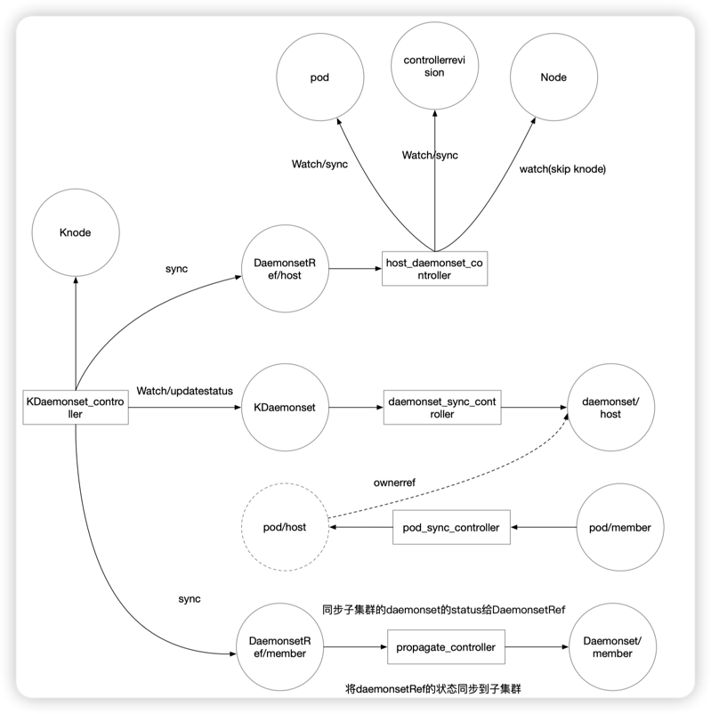

# extersion: kosmos daemonset

## Summary
为kosmos提供daemonset跨集群部署能力

## Motivation
某些产品部署过程中会使用到daemonset并且需要支持跨集群部署，同时需要提供与原生daemonset一致到体验

### Goals
- 实现与原生daemonset体验一致的跨集群daemonset

### Non-Goals

## Proposal
### User Stories (Optional)

## Design Details
### Architecture

### Test Plan
